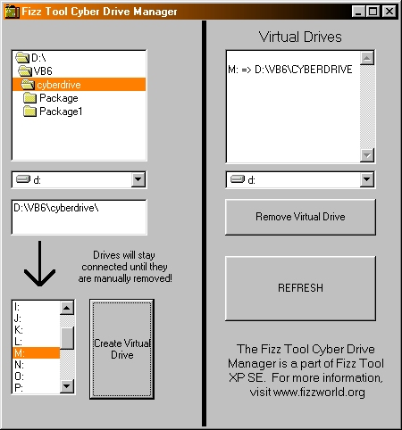



## Fizz CyberDrive

### Description

This GUI Interface will create Virtual Drives on your system. Say you have C:\ as a harddrive and D:\ as a CDROM. You can instantly make W:\ point right to C:\GAMES. Or make Q:\ point to your CDROM drive. Or R:\ become C:\windows! Use any letter. Shows up in explorer and dos mode.
 
### More Info
 
**NOTE: Some users experience a "file not found" error when first starting.. this is normal, and will only happen once. It is creating the "buffer" file which determines what to display as "virtual"**

             |
---                |---
**Submitted On**   |2002-06-01 02:23:40
**By**             |[Andrew Stone](https://github.com/Planet-Source-Code/PSCIndex/blob/master/ByAuthor/andrew-stone.md)
**Level**          |Intermediate
**User Rating**    |4.8 (19 globes from 4 users)
**Compatibility**  |VB 6\.0
**Category**       |[Complete Applications](https://github.com/Planet-Source-Code/PSCIndex/blob/master/ByCategory/complete-applications__1-27.md)
**World**          |[Visual Basic](https://github.com/Planet-Source-Code/PSCIndex/blob/master/ByWorld/visual-basic.md)
**Archive File**   |[Fizz\_Cyber89109612002\.zip](https://github.com/Planet-Source-Code/andrew-stone-fizz-cyberdrive__1-35310/archive/master.zip)

